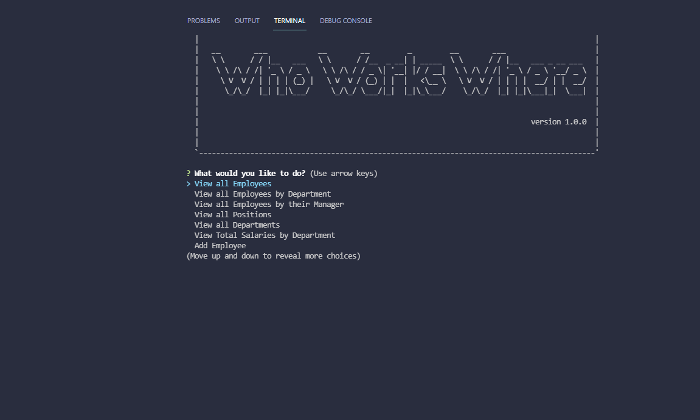

# Employee Tracker


Your Task
Developers frequently have to create interfaces that allow non-developers to easily view and interact with information stored in databases. These interfaces are called content management systems (CMS). Your assignment this week is to build a command-line application from scratch to manage a company's employee database, using Node.js, Inquirer, and MySQL.

Because this application won’t be deployed, you’ll also need to create a walkthrough video that demonstrates its functionality and all of the following acceptance criteria being met. You’ll need to submit a link to the video and add it to the README of your project.

## User Story
```
AS A business owner
I WANT to be able to view and manage the departments, roles, and employees in my company
SO THAT I can organize and plan my business
```

## Acceptance Criteria
```
GIVEN a command-line application that accepts user input
WHEN I start the application
THEN I am presented with the following options: view all departments, view all roles, view all employees, add a department, add a role, add an employee, and update an employee role
WHEN I choose to view all departments
THEN I am presented with a formatted table showing department names and department ids
WHEN I choose to view all roles
THEN I am presented with the job title, role id, the department that role belongs to, and the salary for that role
WHEN I choose to view all employees
THEN I am presented with a formatted table showing employee data, including employee ids, first names, last names, job titles, departments, salaries, and managers that the employees report to
WHEN I choose to add a department
THEN I am prompted to enter the name of the department and that department is added to the database
WHEN I choose to add a role
THEN I am prompted to enter the name, salary, and department for the role and that role is added to the database
WHEN I choose to add an employee
THEN I am prompted to enter the employee’s first name, last name, role, and manager, and that employee is added to the database
WHEN I choose to update an employee role
THEN I am prompted to select an employee to update and their new role and this information is updated in the database 
```

## Table of Contents
* [Installation](#installation)
* [Examples](#examples)
* [Credits](#credits)
* [License](#license)
* [Questions](#questions)
* [Contributing](#contributing)
* [Tests](#tests)

## Installation
  1. ```npm init``` to install package.json.
  2. ```npm i``` to install the necessary packages to run file.
  3. Within the SQL Prompt: Type ```source ./db/schema.sql``` to create the database
  4. (Optional) In the SQL prompt type ``` source ./db/seeds.sql``` to get a sample employee roster
  5. If you opt to create your roster from scratch you will NEED to ADD a department, role, and then employee in this order. Otherwise program will not work as the program works dynamically with the SQL tables.
  6. Please be sure to edit the .env.EXAMPLE file to satisfy your own system requirements, and change the name of the file to just ```.env```

## Examples


[Video Link](https://drive.google.com/file/d/1JH8T53VsMPol6mm29SbWZWlEaQtCFF5W/view?usp=sharing)

## Credits
Our Instructor and both TA's helped a ton throughout this process. My tutor Christian Chavarro helped a ton with getting the SQL to translate onto the prompt as well. 


## License
GNU GENERAL PUBLIC LICENSE
Version 3, 29 June 2007

Copyright (C) 2007 Free Software Foundation, Inc. <https://fsf.org/>
Everyone is permitted to copy and distribute verbatim copies
of this license document, but changing it is not allowed.

---
## Questions
If you have any questions or concerns reach me on [Github](https://github.com/SirNathanJF) or through email at <nathanflessner1@gmail.com>

## Contributing
    No contributions at this time.

## Tests
    No tests are currently being run.
